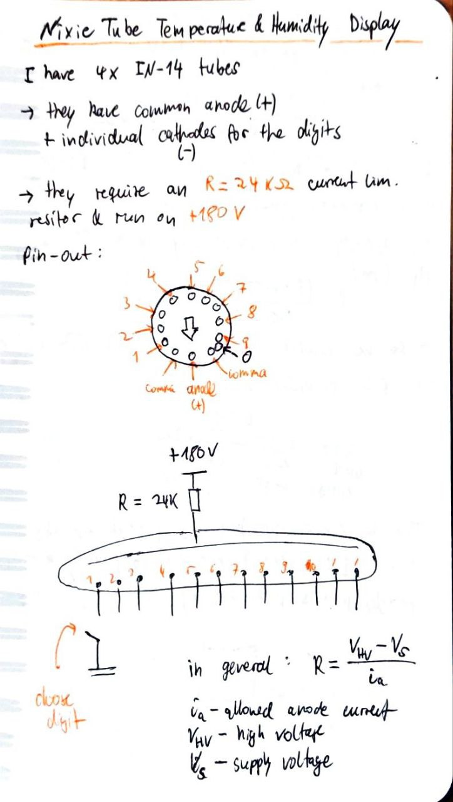
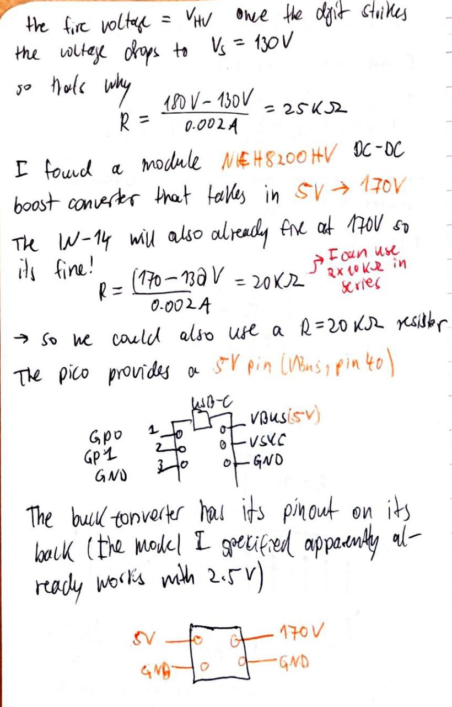
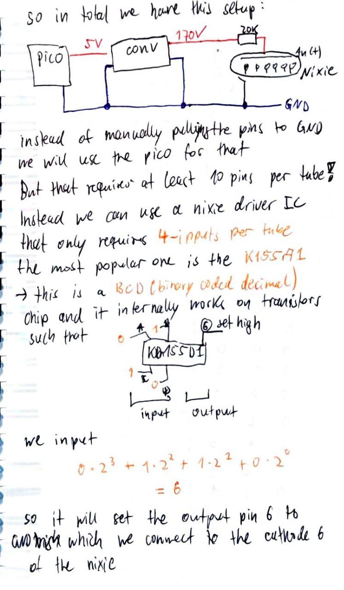
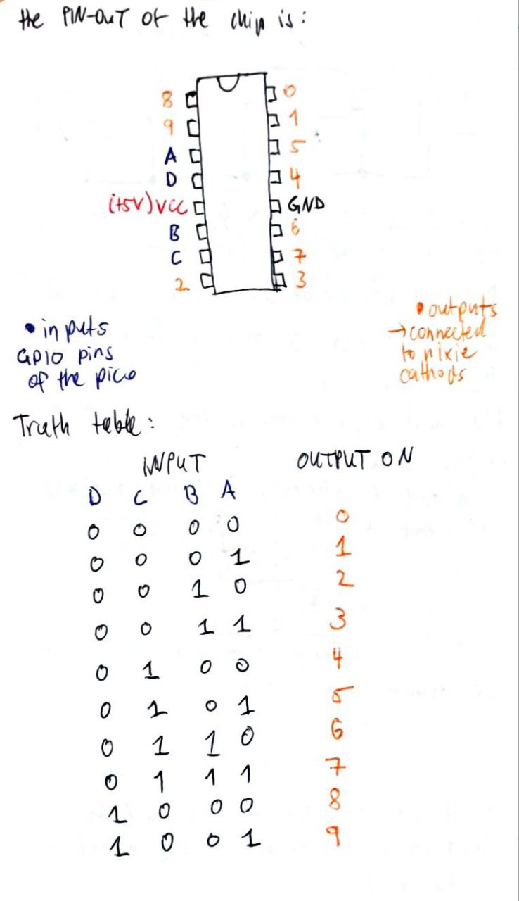

# Nixie Tube Clock and Thermometer

This repository contains the code and instructions for my **Nixie Tube Clock and Thermometer** project.

## Project Goal

The goal of this project is to build a **Nixie tube clock** using four **IN-14 Nixie tubes** controlled by a **Raspberry Pi Pico W**.

The Pico W provides WiFi connectivity, which allows the device to fetch the current time from the internet and display it on the Nixie tubes.

## Features

- Display the **current time** on four IN-14 Nixie tubes  
- Measure **temperature and humidity** using a **DHT22 sensor**
- Switch between different display modes:
  - Time
  - Temperature
  - Humidity
  - Lights off
- WiFi connectivity using the **Raspberry Pi Pico W**

## Planned Future Features

In the future, the temperature and humidity data may be sent from the Pico W to a **home server via a small web server** running on the Pico.

This would allow the measurements to be logged and displayed remotely.

A possible extension is placing the **DHT22 sensor on the balcony** to measure outside temperature and humidity.

## Hardware Overview

### Nixie Tubes

Nixie tubes require approximately **170 V** to ignite the digits.

To generate this voltage, a **5 V → 170 V boost converter** from AliExpress is used.

### Nixie Tube Drivers

Since the **Raspberry Pi Pico W uses 3.3 V logic**, the Nixie tubes cannot be driven directly.

Instead, I use the **Russian KD155D1 Nixie tube driver IC**, which allows controlling a tube digit using **BCD (Binary Coded Decimal)** inputs.

Each driver IC has four input pins:

- A
- B
- C
- D

These pins receive a **binary value from the Pico**, which selects the digit that lights up on the Nixie tube.

### GPIO Requirements

- Each Nixie tube requires **1 driver IC**
- Each driver IC requires **4 GPIO pins**

For **four tubes**, the system requires:

- **4 × KD155D1 driver ICs**
- **16 GPIO pins** on the Pico

## Interface Overview

The general outline of how the Nixie tubes interface with the Pico and how the drivers work is summarized in the handwritten screenshots below.

      

      

      

      
---

## Components Used

- **Raspberry Pi Pico W**
- **4 × IN-14 Nixie Tubes**
- **4 × KD155D1 Nixie Driver ICs**
- **DHT22 Temperature & Humidity Sensor**
- **5 V → 170 V High-Voltage Boost Converter**
- Push button or switch for mode selection

---

## Status

🚧 Work in progress